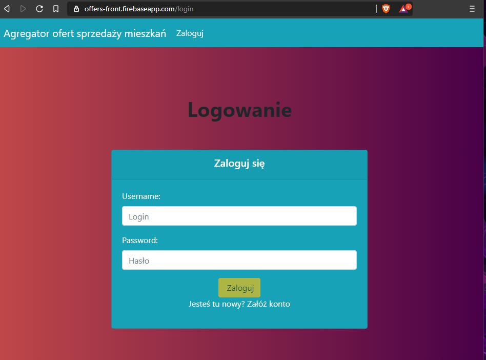
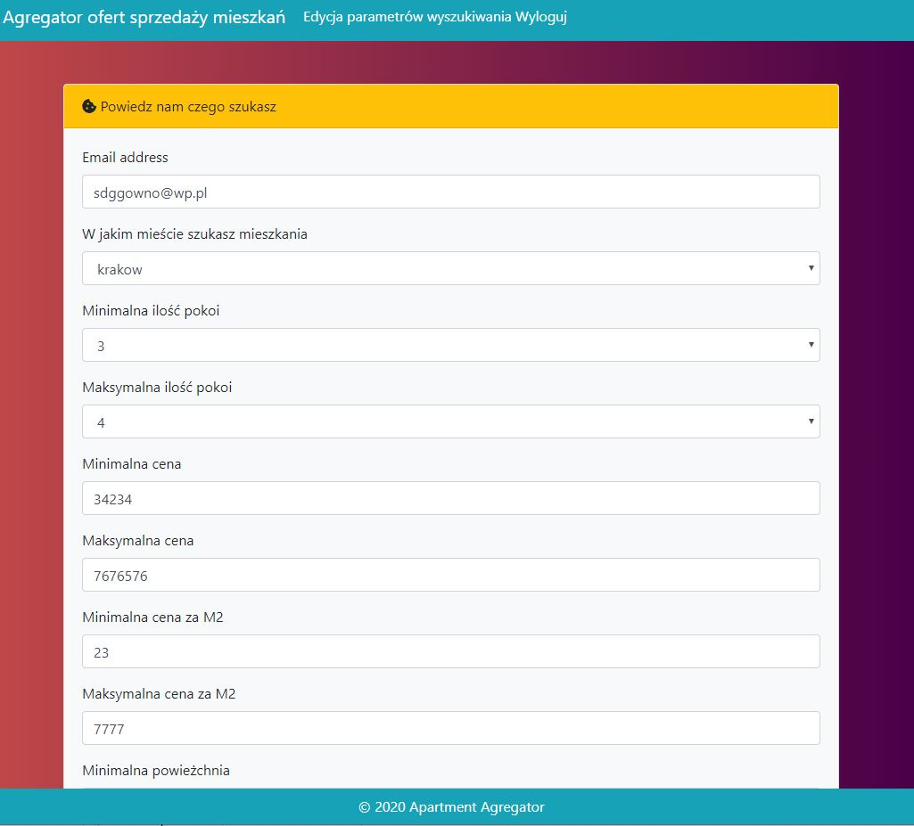

# Webservice for searching apartment sales offers

Webservice for searching apartment sales offers based on collected data in [Apartment-Agregator](https://github.com/MichalFab/ApartmentScraper).

**Features**:
 - Login and registration of users
 - Displaying selected offers according to user settings

**Technologies**

Backend:
 - Spring Boot
 - Spring Security
 - JWT
 - Lombok

Frontend:
 - Angular 8
 - Bootstrap

Screens:

Login screen

Loading of offers

List of offers

User parameters

Offer with description
